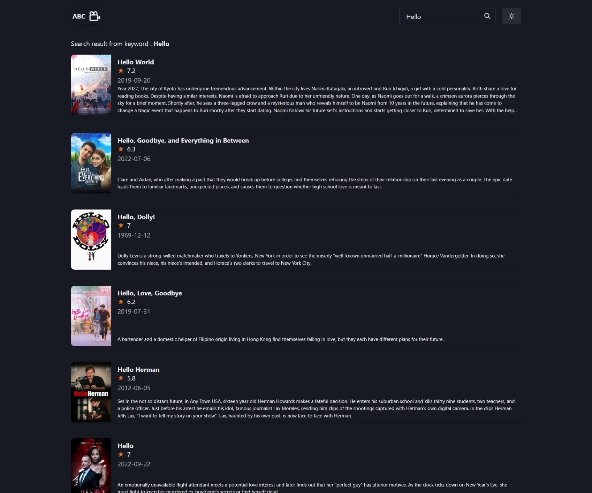

# Movie App

This application is developed by using REACT, TYPESCRIPT, CHAKRA-UI & TMDB API.

DEMO [https://movie-app-wine-theta.vercel.app/](https://movie-app-wine-theta.vercel.app/)

## Screenshots





## Usage

```
git clone https://github.com/anggaalfiansah/movie-app.git
```

```
yarn install
```

```
yarn start
```

Runs the app in the development mode.\
Open [http://localhost:3000](http://localhost:3000) to view it in the browser.
